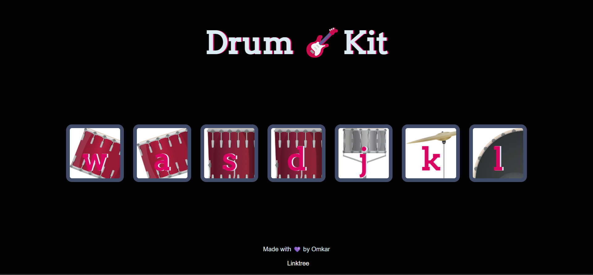

# Drum-Kit Web app🎸
Have you ever imagined making that drum kit on your own virtually with the help of some scripting language? Well, so here i am with the drum kit app that runs in the browser.  

# Main concepts-
    - DOM
    - key events
    - Constructor functions
    - CSS animations
    - querySelector
    - Adding event listeners to buttons and keystrokes
    
If you do try to code this funny and entertaining website you will end up with an awesome Website
that you can impress all of your friends with.

# Preview of the Website:
 

  

If you like it, do fork 🍴 and star ⭐

